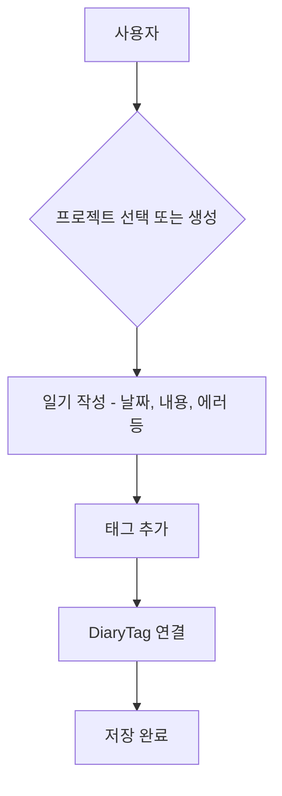
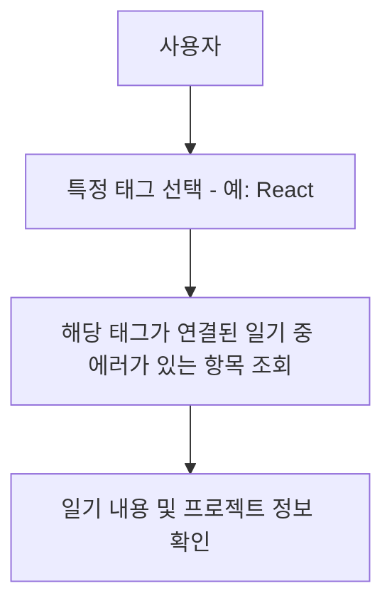
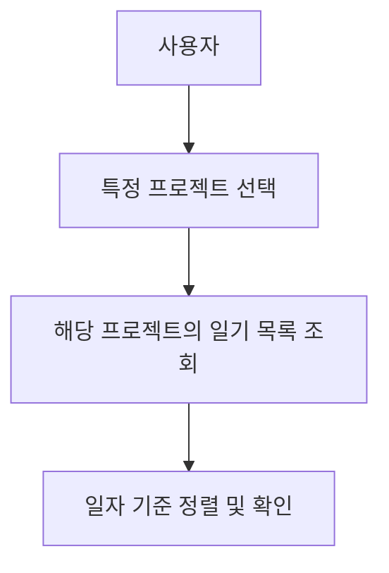
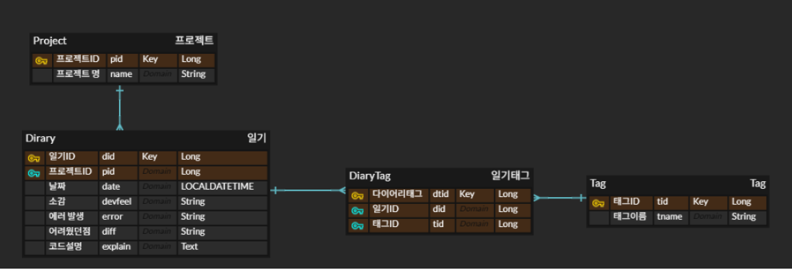

# 2. 비즈니스 도메인 분석

## 핵심 도메인

| 도메인명   | 설명                                                   |
|------------|--------------------------------------------------------|
| `Project`  | 사용자가 작성하는 일기의 주제 (예: "개발 일기 웹앱")             |
| `Diary`    | 하루에 작성되는 개발 일기. 특정 `Project`와 연결됨                |
| `Tag`      | 일기와 연결된 기술 또는 키워드 (예: Java, Spring)               |
| `DiaryTag` | `Diary`와 `Tag` 간 다대다(N:M) 관계를 나타내는 중간 연결 테이블 |

---

## 2.1 핵심 비즈니스 프로세스

###  일기 작성 프로세스

**상세 플로우:**

- 사용자가 `Project`를 선택하거나 새로 생성  
- 해당 프로젝트에 대한 하루 일기(`Diary`)를 작성 (날짜, 개발 내용, 에러 등)  
- 관련 기술 키워드를 `Tag`로 추가  
- 저장 시 `Diary`와 `Tag`가 `DiaryTag`를 통해 연결됨  

---

###  태그 기반 에러 검색 프로세스

**상세 플로우:**

- 사용자가 특정 `Tag`(예: React)를 선택하여 검색  
- 해당 `Tag`가 연결된 `Diary` 중 `error IS NOT NULL` 조건으로 필터링  
- 각 `Diary`의 프로젝트 및 에러 내용 확인 가능  

---

###  프로젝트별 일기 관리 프로세스

**상세 플로우:**

- 사용자가 특정 `Project`를 선택  
- 해당 프로젝트에 연결된 `Diary` 목록 조회  
- 일자별 정렬된 일기 확인  

---
## 관계도 및 객체정의

## 비즈니스 규칙

| 규칙 항목                                                    | 설명                                               |
|-------------------------------------------------------------|----------------------------------------------------|
| 하나의 `Project`에는 여러 개의 `Diary`가 연결될 수 있음         | 1:N 관계                                            |
| 하나의 `Diary`는 여러 개의 `Tag`와 연결될 수 있음              | `DiaryTag`를 통한 N:M 관계                         |
| 하나의 `Tag`는 여러 개의 `Diary`와 연결될 수 있음              | N:M 관계                                            |
| 일기는 `작성 날짜` 기준으로 정렬되며, 동일 날짜에 여러 개 작성 가능 | 중복 날짜 허용                                      |
| `Tag`는 중복 없이 관리되며, 연결 정보는 `DiaryTag`로 관리됨      | 태그는 고유하게 관리됨                             |
| `Project` 삭제 시 연결된 `Diary`도 함께 삭제됨                 | Cascade Delete 적용 필요                           |
| `Diary` 삭제 시 연결된 `DiaryTag`도 함께 삭제됨                | Cascade Delete 적용 필요                           |
