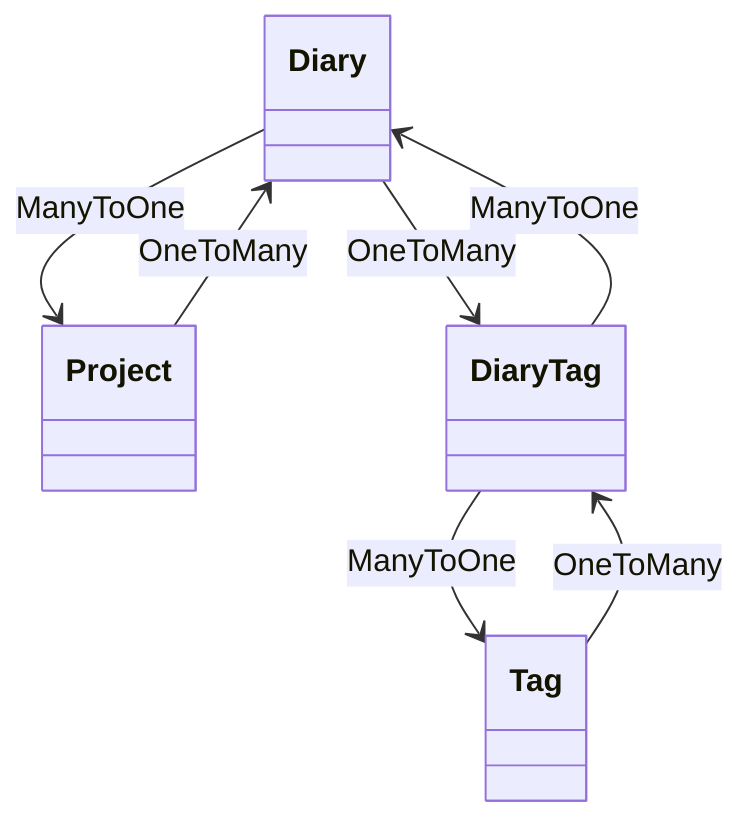

# Entity 설계서

## 문서 정보
- **프로젝트명**: 개발 일기 관리 시스템
- **작성자**: [3조/김인태]
- **작성일**: [2025-06-08]
- **버전**: [v1.0]
- **검토자**: [백엔드 개발자명]
- **승인자**: [팀 리더명]

---

## 1. Entity 설계 개요

### 1.1 설계 목적
> 개발자의 프로젝트 활동을 기록하고, 태그 기반으로 분류 및 검색할 수 있는 일기 관리 시스템의 핵심 도메인을 정의함

### 1.2 설계 원칙
- **단일 책임 원칙**: 하나의 Entity는 하나의 비즈니스 개념만 표현
- 불변성을 지향하되 JPA 운용을 고려한 Setter 허용
- 연관관계 최소화, 순환참조 방지
- LAZY fetch 전략 기본 적용

### 1.3 기술 스택
- **ORM 프레임워크**: Spring Data JPA 2.7.x
- **데이터베이스**: MariaDB 10.11
- **검증 프레임워크**: Bean Validation 2.0
- **감사 기능**: 추후 적용 가능 (BaseEntity 상속 시 고려)

---

## 2. Entity 목록 및 분류

### 2.1 Entity 분류 매트릭스
| Entity명      | 유형 | 비즈니스 중요도 | 기술적 복잡도 | 연관관계 수 | 우선순위 |
| ------------ | -- | -------- | ------- | ------ | ---- |
| **Diary**    | 핵심 | 높음       | 중간      | 3개     | 1순위  |
| **Project**  | 핵심 | 중간       | 낮음      | 1개     | 2순위  |
| **Tag**      | 지원 | 중간       | 낮음      | 1개     | 2순위  |
| **DiaryTag** | 조인 | 중간       | 중간      | 2개     | 2순위  |


### 2.2 Entity 상속 구조


---

## 3. 공통 설계 규칙

### 3.1 네이밍 규칙
| 구분          | 규칙          | 예시                     | 비고          |
| ----------- | ----------- | ---------------------- | ----------- |
| Entity 클래스명 | PascalCase  | `Diary`, `Project`     | 단수형 사용      |
| 테이블명        | snake\_case | `diary`, `diary_tag`   | 소문자, 복수형 생략 |
| 컬럼명         | snake\_case | `did`, `pid`           | 언더스코어 표기    |
| 연관관계 필드     | camelCase   | `project`, `diaryTags` | 단방향, 객체 참조명 |
| boolean 필드  | is + 형용사    | `isActive`             | 의미 명확히      |


### 3.3 ID 생성 전략
| Entity | 전략 | 이유 | 예시 |
|--------|------|------|------|
| **Member** | IDENTITY | MariaDB Auto Increment 활용 | 1, 2, 3, ... |
| **Book** | IDENTITY | 단순한 순차 증가 | 1, 2, 3, ... |
| **Loan** | IDENTITY | 대출 순서 보장 | 1, 2, 3, ... |
| **Category** | IDENTITY | 계층 구조 지원 | 1, 2, 3, ... |

---

## 4. 상세 Entity 설계

### 4.1 Diary Entity

#### 4.1.1 기본 정보
```java
@Entity
@Table(name = "diary")
@NoArgsConstructor
@AllArgsConstructor
@Getter
@Setter
@Builder
public class Diary {
    // 필드 정의 (아래 상세 명세 참조)
}

```

#### 4.1.2 필드 상세 명세
| 필드명              | 데이터 타입      | 컬럼명            | 제약조건                          | 설명         | 비즈니스 규칙                |
| ---------------- | ----------- | -------------- | ----------------------------- | ---------- | ---------------------- |
| **did**          | `Long`      | `did`          | PK, NOT NULL, AUTO\_INCREMENT | 다이어리 고유 ID | 시스템 자동 생성              |
| **date**         | `LocalDate` | `date`         | NOT NULL                      | 작성 일자      | 하루에 하나만 허용 (로직상 검증 필요) |
| **devfeel**      | `String`    | `devfeel`      | LENGTH(500)                   | 개발하면서 느낀 점 | 선택 항목                  |
| **diff**         | `String`    | `diff`         | LENGTH(500)                   | 어려웠던 점     | 선택 항목                  |
| **error**        | `String`    | `error`        | LENGTH(500)                   | 발생한 에러     | 선택 항목                  |
| **explaination** | `String`    | `explaination` | TEXT                          | 문제 해결 설명   | 선택 항목                  |


#### 4.1.3 연관관계 매핑
```java
// 다이어리 ↔ 프로젝트 (N:1)
@ManyToOne(fetch = FetchType.LAZY)
@JoinColumn(name = "pid", nullable = true)
private Project project;

// 다이어리 ↔ 다이어리태그 (1:N)
@OneToMany(mappedBy = "diary", cascade = CascadeType.ALL, orphanRemoval = true)
private List<DiaryTag> diaryTags = new ArrayList<>();

```

### 4.2 Project Entity

#### 4.2.1 필드 상세 명세
| 필드명      | 데이터 타입   | 컬럼명    | 제약조건                          | 설명         | 비즈니스 규칙   |
| -------- | -------- | ------ | ----------------------------- | ---------- | --------- |
| **pid**  | `Long`   | `pid`  | PK, NOT NULL, AUTO\_INCREMENT | 프로젝트 고유 ID | 시스템 자동 생성 |
| **name** | `String` | `name` | NOT NULL, UNIQUE              | 프로젝트명      | 중복 불가, 필수 |


#### 4.2.3 연관관계 매핑
```java
// 프로젝트 ↔ 다이어리 (1:N)
@OneToMany(mappedBy = "project", cascade = CascadeType.ALL, orphanRemoval = true)
private List<Diary> diaries = new ArrayList<>();

```

### 4.3 Tag Entity

#### 4.3.1 필드 상세 명세
| 필드명      | 데이터 타입   | 컬럼명    | 제약조건                          | 설명       | 비즈니스 규칙   |
| -------- | -------- | ------ | ----------------------------- | -------- | --------- |
| **tid**  | `Long`   | `tid`  | PK, NOT NULL, AUTO\_INCREMENT | 태그 고유 ID | 시스템 자동 생성 |
| **name** | `String` | `name` | NOT NULL, UNIQUE              | 태그 이름    | 중복 불가, 필수 |


#### 4.3.2 연관관계 매핑
```java
// 태그 ↔ 다이어리태그 (1:N)
@OneToMany(mappedBy = "tag", cascade = CascadeType.ALL, orphanRemoval = true)
private List<DiaryTag> diaryTags = new ArrayList<>();

```
### 4.4 DiaryTag Entity

#### 4.4.1 필드 상세 명세
| 필드명      | 데이터 타입 | 컬럼명    | 제약조건                          | 설명    | 비즈니스 규칙   |
| -------- | ------ | ------ | ----------------------------- | ----- | --------- |
| **dtid** | `Long` | `dtid` | PK, NOT NULL, AUTO\_INCREMENT | 조인 ID | 시스템 자동 생성 |

#### 4.3.2 연관관계 매핑
```java
// 다이어리태그 ↔ 다이어리 (N:1)
@ManyToOne(fetch = FetchType.LAZY)
@JoinColumn(name = "did", nullable = false)
private Diary diary;

// 다이어리태그 ↔ 태그 (N:1)
@ManyToOne(fetch = FetchType.LAZY)
@JoinColumn(name = "tid", nullable = false)
private Tag tag;
```
---

## 5. 연관관계 매핑 전략

### 5.1 연관관계 매핑 규칙
| 관계 유형        | Entity               | 필드명         | 기본 전략 | 이유                         | 예외 상황                   |
| ------------ | -------------------- | ----------- | ----- | -------------------------- | ----------------------- |
| `@ManyToOne` | `Diary` → `Project`  | `project`   | LAZY  | 프로젝트는 선택적 관계이며 자주 조회되지 않음  | -                       |
| `@ManyToOne` | `DiaryTag` → `Diary` | `diary`     | LAZY  | 다이어리가 항상 필요한 경우는 아님        | -                       |
| `@ManyToOne` | `DiaryTag` → `Tag`   | `tag`       | LAZY  | 태그는 사전 정의되며 캐시 또는 지연 로딩 가능 | -                       |
| `@OneToMany` | `Project` → `Diary`  | `diaries`   | LAZY  | 프로젝트별 일기 목록은 일반적으로 조회되지 않음 | 관리용 페이지 등에서 EAGER 고려 가능 |
| `@OneToMany` | `Diary` → `DiaryTag` | `diaryTags` | LAZY  | 태그는 일기와 함께 쓰이긴 하나 필수 아님    | 필요 시 DTO로 fetch         |
| `@OneToMany` | `Tag` → `DiaryTag`   | `diaryTags` | LAZY  | 태그에 연결된 일기 목록은 주로 분석/검색용   | -                       |


### 5.2 Cascade 옵션 가이드
```java
// Diary → DiaryTag (강한 부모-자식 관계)
@OneToMany(mappedBy = "diary", cascade = CascadeType.ALL, orphanRemoval = true)
private List<DiaryTag> diaryTags = new ArrayList<>();

// Tag → DiaryTag (강한 부모-자식 관계)
@OneToMany(mappedBy = "tag", cascade = CascadeType.ALL, orphanRemoval = true)
private List<DiaryTag> diaryTags = new ArrayList<>();

// Project → Diary (강한 부모-자식 관계)
@OneToMany(mappedBy = "project", cascade = CascadeType.ALL, orphanRemoval = true)
private List<Diary> diaries = new ArrayList<>();

// Diary → Project (약한 참조 관계)
@ManyToOne(fetch = FetchType.LAZY)
@JoinColumn(name = "pid", nullable = true)
private Project project; // cascade 없음
```

### 5.3 양방향 연관관계 관리
```java
// Diary Entity
public void addTag(Tag tag) {
    DiaryTag diaryTag = new DiaryTag(this, tag);
    diaryTags.add(diaryTag);
    tag.getDiaryTags().add(diaryTag);
}

public void removeTag(Tag tag) {
    diaryTags.removeIf(dt -> {
        boolean match = dt.getTag().equals(tag);
        if (match) tag.getDiaryTags().remove(dt);
        return match;
    });
}

// Project Entity
public void addDiary(Diary diary) {
    diaries.add(diary);
    diary.setProject(this);
}

public void removeDiary(Diary diary) {
    diaries.remove(diary);
    diary.setProject(null);
}

// Tag Entity
public void addDiaryTag(Diary diary) {
    DiaryTag diaryTag = new DiaryTag(diary, this);
    diaryTags.add(diaryTag);
    diary.getDiaryTags().add(diaryTag);
}
```
---

## 6. 테스트 전략
### 6.1 EntityIntegrity 테스트
```java
// EntityIntegrityTest.java
@DataJpaTest
@ActiveProfiles("prod")
class EntityIntegrityTest {

    @Autowired private ProjectRepository projectRepository;
    @Autowired private DiaryRepository diaryRepository;
    @Autowired private TagRepository tagRepository;
    @Autowired private DiaryTagRepository diaryTagRepository;

    @Test
    @DisplayName("Diary의 날짜가 null이면 저장 실패")
    void diary_date_null_예외() {
        Project project = new Project("무결성 테스트");
        projectRepository.save(project);

        Diary diary = Diary.builder()
                .date(null)
                .devfeel("내용")
                .project(project)
                .build();

        assertThrows(DataIntegrityViolationException.class, () -> {
            diaryRepository.saveAndFlush(diary);
        });
    }

    @Test
    @DisplayName("Project 이름이 null이면 저장 실패")
    void project_name_null_예외() {
        Project project = new Project(null);

        assertThrows(DataIntegrityViolationException.class, () -> {
            projectRepository.saveAndFlush(project);
        });
    }

    @Test
    @DisplayName("Tag 이름 중복 시 저장 실패")
    void tag_name_duplicate_예외() {
        Tag tag1 = Tag.builder().name("중복태그").build();
        Tag tag2 = Tag.builder().name("중복태그").build();

        tagRepository.save(tag1);

        assertThrows(DataIntegrityViolationException.class, () -> {
            tagRepository.saveAndFlush(tag2);
        });
    }

    @Test
    @DisplayName("DiaryTag의 diary가 null이면 저장 실패")
    void diarytag_diary_null_예외() {
        Tag tag = Tag.builder().name("태그1").build();
        tagRepository.save(tag);

        DiaryTag diaryTag = DiaryTag.builder()
                .diary(null)
                .tag(tag)
                .build();

        assertThrows(DataIntegrityViolationException.class, () -> {
            diaryTagRepository.saveAndFlush(diaryTag);
        });
    }

    @Test
    @DisplayName("DiaryTag의 tag가 null이면 저장 실패")
    void diarytag_tag_null_예외() {
        Project project = new Project("태그 null 테스트");
        projectRepository.save(project);

        Diary diary = Diary.builder()
                .date(LocalDate.now())
                .project(project)
                .devfeel("기분")
                .build();
        diaryRepository.save(diary);

        DiaryTag diaryTag = DiaryTag.builder()
                .diary(diary)
                .tag(null)
                .build();

        assertThrows(DataIntegrityViolationException.class, () -> {
            diaryTagRepository.saveAndFlush(diaryTag);
        });
    }
}
```
### 6.1 Repository 테스트
```java
// DiaryRepositoryTest.java
@DataJpaTest
@ActiveProfiles("prod") // MariaDB 실제 설정 사용
class DiaryRepositoryTest {


    @Autowired
    private DiaryRepository diaryRepository;

    @Autowired
    private ProjectRepository projectRepository;

    @Test
    @DisplayName("프로젝트로 일기 목록 조회")
    void findByProject_성공() {
        // given
        Project project = new Project("테스트 프로젝트");
        projectRepository.save(project);

        Diary diary = new Diary(LocalDate.now(), "테스트 내용", project);
        diaryRepository.save(diary);

        // when
        List<Diary> diaries = diaryRepository.findByProject(project);

        // then
        assertThat(diaries).hasSize(1);
        assertThat(diaries.get(0).getDevfeel()).isEqualTo("테스트 내용");
    }

    @Test
    @DisplayName("날짜 범위로 일기 조회")
    void findByDateBetween_성공() {
        // given
        Project project = new Project("범위 테스트");
        projectRepository.save(project);

        Diary diary1 = new Diary(LocalDate.of(2024, 1, 1), "일기1", project);
        Diary diary2 = new Diary(LocalDate.of(2024, 1, 5), "일기2", project);
        diaryRepository.saveAll(List.of(diary1, diary2));

        // when
        List<Diary> results = diaryRepository.findByDateBetween(
                LocalDate.of(2024, 1, 1),
                LocalDate.of(2024, 1, 10)
        );

        // then
        assertThat(results).hasSize(2);
    }

    @Test
    @DisplayName("날짜가 null인 경우 저장 실패 (무결성 검증)")
    void date가_null이면_예외발생() {
        // given
        Project project = new Project("무결성 테스트");
        projectRepository.save(project);

        Diary diary = new Diary(null, "내용", project); // 날짜 null

        // when & then
        assertThrows(DataIntegrityViolationException.class, () -> {
            diaryRepository.saveAndFlush(diary);
        });
    }
}

// DiaryTagRepositoryTest.java
@DataJpaTest
@ActiveProfiles("prod")
class DiaryTagRepositoryTest {

    @Autowired
    private DiaryTagRepository diaryTagRepository;

    @Autowired
    private DiaryRepository diaryRepository;

    @Autowired
    private ProjectRepository projectRepository;

    @Autowired
    private TagRepository tagRepository;

    @Test
    @DisplayName("특정 태그로 DiaryTag 목록 조회")
    void findByTag_성공() {
        // given
        Project project = new Project("다이어리 태그 테스트");
        projectRepository.save(project);

        Diary diary = Diary.builder()
                .date(LocalDate.now())
                .project(project)
                .devfeel("기분 좋음")
                .build();
        diaryRepository.save(diary);

        Tag tag = Tag.builder()
                .name("테스트 태그")
                .build();
        tagRepository.save(tag);

        DiaryTag diaryTag = DiaryTag.builder()
                .diary(diary)
                .tag(tag)
                .build();
        diaryTagRepository.save(diaryTag);

        // when
        List<DiaryTag> result = diaryTagRepository.findByTag(tag);

        // then
        assertThat(result).hasSize(1);
        assertThat(result.get(0).getTag().getName()).isEqualTo("테스트 태그");
        assertThat(result.get(0).getDiary().getDevfeel()).isEqualTo("기분 좋음");
    }
}

// ProjectRepositoryTest.java
@DataJpaTest
@ActiveProfiles("prod")
class ProjectRepositoryTest {

    @Autowired
    private ProjectRepository projectRepository;

    @Test
    @DisplayName("프로젝트 이름으로 조회 성공")
    void findByName_성공() {
        // given
        Project project = new Project("개발일지 프로젝트");
        projectRepository.save(project);

        // when
        Optional<Project> result = projectRepository.findByName("개발일지 프로젝트");

        // then
        assertThat(result).isPresent();
        assertThat(result.get().getName()).isEqualTo("개발일지 프로젝트");
    }

    @Test
    @DisplayName("존재하지 않는 프로젝트 이름 조회시 빈 Optional 반환")
    void findByName_실패() {
        // when
        Optional<Project> result = projectRepository.findByName("없는 프로젝트");

        // then
        assertThat(result).isNotPresent();
    }
}

// TagRepositoryTest.java
@DataJpaTest
@ActiveProfiles("prod")
class TagRepositoryTest {

    @Autowired
    private TagRepository tagRepository;

    @Test
    @DisplayName("태그 이름으로 조회 성공")
    void findByName_성공() {
        // given
        Tag tag = Tag.builder()
                .name("Spring")
                .build();
        tagRepository.save(tag);

        // when
        Optional<Tag> result = tagRepository.findByName("Spring");

        // then
        assertThat(result).isPresent();
        assertThat(result.get().getName()).isEqualTo("Spring");
    }

    @Test
    @DisplayName("존재하지 않는 태그 이름 조회시 빈 Optional 반환")
    void findByName_실패() {
        // when
        Optional<Tag> result = tagRepository.findByName("NonExistentTag");

        // then
        assertThat(result).isNotPresent();
    }
}
```

---

## 7. 성능 모니터링

### 7.1 쿼리 성능 로깅 설정
```yaml
# application.yml 공통 설정

logging:
  level:
    org.hibernate.SQL: debug  # 실행되는 SQL 쿼리 로그
    org.hibernate.type.descriptor.sql.BasicBinder: trace  # 바인딩 파라미터 로그

spring:
  jpa:
    show-sql: true  # SQL 출력 활성화

```

### 7.2 개발환경 상세 설정

```yaml
# application-dev.yml

spring:
  jpa:
    hibernate:
      ddl-auto: update
    show-sql: true
    database-platform: org.hibernate.dialect.MySQLDialect
    properties:
      hibernate:
        format_sql: true  # 보기 좋게 정렬된 SQL 출력
        use_sql_comments: true  # 쿼리에 주석 포함
        generate_statistics: true  # 하이버네이트 통계 활성화
        jdbc:
          batch_size: 50  # 배치 처리 크기
          batch_versioned_data: true
        order_inserts: true
        order_updates: true

logging:
  level:
    root: debug
    com.devdiary: debug
    org.hibernate.SQL: debug
    org.hibernate.type.descriptor.sql.BasicBinder: trace

```

### 7.3 테스트 환경 최소 설정
```yaml
# application-test.yml

spring:
  datasource:
    url: jdbc:h2:mem:testdb;DB_CLOSE_DELAY=-1;DB_CLOSE_ON_EXIT=FALSE
    driver-class-name: org.h2.Driver
    username: sa
  jpa:
    hibernate:
      ddl-auto: create-drop
    show-sql: true
    database-platform: org.hibernate.dialect.H2Dialect

logging:
  level:
    root: warn
    com.devdiary: info
    org.hibernate.SQL: info

```

### 7.4 운영환경 성능 위주 설정
```yaml
# application-prod.yml

spring:
  jpa:
    hibernate:
      ddl-auto: create
    show-sql: true
    database-platform: org.hibernate.dialect.MariaDBDialect
    properties:
      hibernate:
        generate_statistics: true
        jdbc:
          batch_size: 50
          batch_versioned_data: true
        order_inserts: true
        order_updates: true

logging:
  level:
    root: warn
    com.example.myapp: info
    org.hibernate.SQL: debug
    org.hibernate.type.descriptor.sql.BasicBinder: trace

```
---
