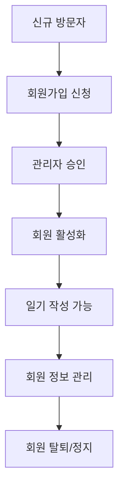
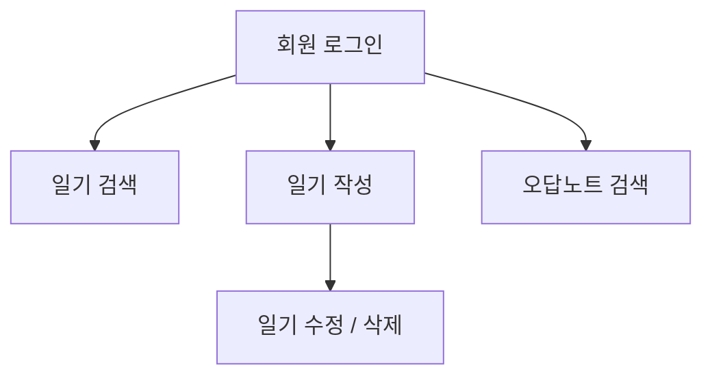
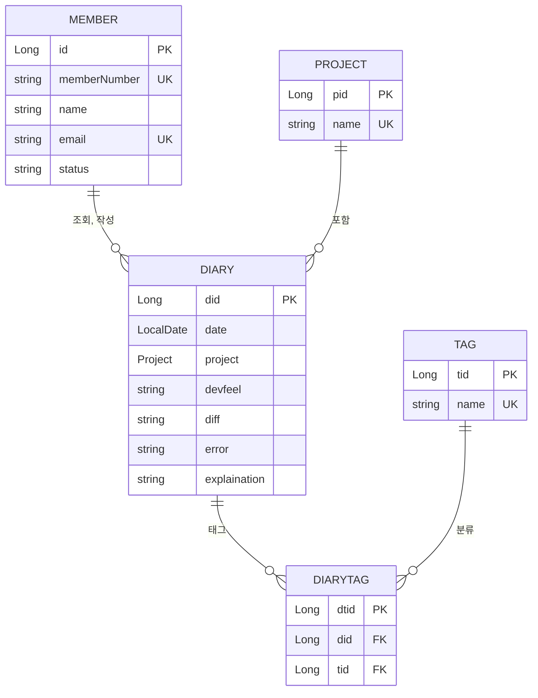
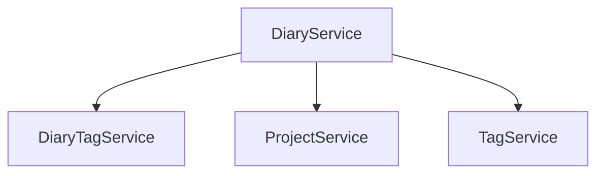

# 도메인 설계서

## 문서 정보
- **프로젝트명**: 개발 일기 관리 시스템
- **작성자**: [3조/김인태]
- **작성일**: [2025-06-25]
- **버전**: [v1.0]
---

## 1. 프로젝트 개요

### 1.1 프로젝트 목적
> 개발자의 학습과 성장을 지원하는 개발 일기 작성 시스템으로, 일일 개발 활동을 체계적으로 기록하고 축적된 경험을 효과적으로 활용할 수 있도록 돕는 서비스를 제공한다.

### 1.2 프로젝트 범위
**포함 범위:**
- [ ] 회원 관리 (등록, 정보 수정, 탈퇴)
- [ ] 일기 관리 (등록, 수정, 삭제, 검색)
- [ ] 에러 관리 (등록, 수정, 삭제, 검색)
- [ ] 태그 시스템 (태그를 활용한 접근성 높은 검색)

**제외 범위:**
- [ ] 깃 허브 연동 (코드 저장은 간단하게만)
- [ ] 모바일 앱 (웹 기반만)

### 1.3 주요 이해관계자 (Stakeholders)
| 구분 | 역할 | 주요 관심사 |
|-----|------|------------|
| **개발자** | 시스템 사용자 | 편리한 일일 개발 활동 기록, 직관적인 인터페이스 |
| **IT 관리자** | 시스템 관리자 | 시스템 안정성, 보안, 유지보수성 |

---

## 2. 비즈니스 도메인 분석

### 2.1 핵심 비즈니스 프로세스

#### 2.1.1 회원 관리 프로세스

**상세 플로우:**
1. **회원가입 단계**
   - 개인정보 입력 (이름, 연락처, 주소 등)
   - 이메일 인증
   - 관리자 승인 대기
   - 회원번호(ID) 자동 발급

2. **회원 활동 단계**
   - 일기 작성 및 일기 검색
   - 개인정보 수정
   - 오답노트 조회

#### 2.1.2 일기 관리 프로세스

**비즈니스 규칙:**
- 작성일자와 프로젝트명은 반드시 입력해야 함
- 회원당 일기 작성 제한 없음
- 일반 태그와 에러 태그는 별도로 관리

### 2.2 비즈니스 이벤트
| 이벤트 | 트리거 | 결과 |
|--------|--------|------|
| **회원가입 완료** | 관리자 승인 | 회원번호 발급, 환영 이메일 발송 |
| **일기 작성 완료** | 회원 작성 | 일기 수 증가, 작성일 설정, 태그 설정 |
| **일기 수정 완료** | 회원 수정 | 기존 일기 내용 업데이트 |
| **일기 삭제 완료** | 회원 삭제 | 일기 수 감소 |
| **일기 검색** | 회원 검색 | 필터에 맞는 일기 제공 |
| **오답노트 검색** | 회원 검색 | 필터에 맞는 에러 기록 제공 |

---

## 3. 핵심 도메인 객체 (Domain Objects)

### 3.1 도메인 객체 식별 매트릭스
| 도메인 객체 | 유형 | 중요도 | 복잡도 | 비고 |
|------------|------|--------|--------|------|
| **Member (회원)** | Entity | 높음 | 중간 | 핵심 사용자 |
| **Diary (일기)** | Entity | 높음 | 중간 | 핵심 자원 |
| **Tag (태그)** | Entity | 중간 | 낮음 | 일기 분류 |
| **Admin (관리자)** | Entity | 중간 | 낮음 | 시스템 운영자 |

### 3.2 상세 도메인 객체 정의

#### 3.2.1 Member (회원)
**역할**: 도서관 서비스를 이용하는 회원을 나타냄

**주요 속성:**

**주요 행동 (메서드):**

**비즈니스 규칙:**

#### 3.2.2 Diary (일기)
**역할**: 회원이 작성하는 일일 개발 일기 

**주요 속성:**
- `did`: 고유 식별자 
- `date`: 일기 작성 일자
- `project`: 프로젝트명
- `devfeel`: 느낀점
- `diff`: 어려웠던점 
- `error`: 발생 에러
- `explaination`: 에러에 대한 설명
- `diaryTags`: 일기 태그

**주요 행동 (메서드):**
- `getTags()`: 태그 리스트 추출 메서드

**비즈니스 규칙:**
- 작성 일자와 프로젝트 명은 반드시 입력해야함
- 하루에 여러 개의 일기를 작성할 수 있음

#### 3.2.3 Tags (태그)
**역할**: 회원과 도서 간의 대출 관계를 나타냄

**주요 속성:**
- `id`: 고유 식별자 
- `name`: 태그 이름

**비즈니스 규칙:**
- 일반 태그와 에러 태그는 따로 관리
---

## 4. 도메인 관계도

### 4.1 개념적 관계도

### 4.2 관계 상세 설명
| 관계 | 카디널리티 | 설명 |
|------|------------|------|
| **Member ↔ Diary** | 1:N | 한 회원은 여러 일기를 작성할 수 있음   |
| **Tag ↔ DiaryTag** | 1:N | 한 태그가 여러 일기와 연결됨 |
| **Project ↔ Diary** | 1:N | 한 프로젝트가 여러 일기와 연결됨 |
| **DiaryTag ↔ Diary** | N:1 | 다이어리에 여러개의 태그 가능   |
| **DiaryTag ↔ Tag** | N:1 | 태그 중간 연결 | 

---

## 5. 비즈니스 규칙 (Business Rules)

### 5.1 개발일기 작성 규칙
| 규칙 ID | 규칙 내용 | 우선순위 | 검증 방법 |
|---------|-----------|----------|-----------|
| **BR-D001** | 작성일자와 프로젝트명은 반드시 입력해야 함 | 높음 | 입력 되어있는지 확인 |
| **BR-D002** | 하루에 여러 개의 일기를 작성할 수 있음 | 중간 | -- |

### 5.2 프로젝트 관리 규칙
| 규칙 ID | 규칙 내용 | 우선순위 | 검증 방법 |
|---------|-----------|----------|-----------|
| **BR-P001** | 동일 프로젝트의 일기들은 시간순으로 정렬 | 높음 | 시간순 정렬 |
| **BR-P002** | 기존 프로젝트 목록에서 선택하거나 새로운 프로젝트 생성 가능 | 높음 | -- |

### 5.3 검색 및 필터링 규칙
| 규칙 ID | 규칙 내용 | 우선순위 | 검증 방법 |
|---------|-----------|----------|-----------|
| **BR-F001** | 프로젝트, 태그, 날짜를 조합하여 검색 가능 | 높음 | 각각 적용되는지 확인 |
| **BR-F002** | 기본적으로 최신순으로 정렬하여 표시 | 높음 | 모든 일기 시간순 정렬 |

---

## 6. 도메인 서비스 (Domain Services)

### 6.1 식별된 도메인 서비스
| 서비스명 | 책임 | 사용 시나리오 |
|----------|------|---------------|
| **DiaryService** | 일기 관리 | 일기 작성, 조회, 수정, 삭제 |
| **DiaryTagService** | 일기 태그 관리 | 태그 생성, 조회 |
| **ProjectService** | 프로젝트 관리 | 프로젝트 생성, 조회 |
| **TagService** | 에러 태그 관리 | 태그 생성 및 조회 |

### 6.2 서비스 상호작용

---

## 7. 용어 정의 (Glossary)

### 7.1 비즈니스 용어
| 용어 | 정의 | 영문 |
|------|------|------|
| **개발일기** | 개발자가 하루 동안의 개발 활동, 학습 내용, 문제 해결 과정을 기록한 일기 | Development Diary |
| **프로젝트** | 개발 일기가 속하는 상위 개념으로, 특정 개발 과제나 학습 주제를 의미 | Project |
| **일기태그** | 개발 일기의 내용을 분류하고 검색하기 위한 키워드 | Diary Tag |
| **에러태그** | 에러 기록을 분류하기 위한 전문 태그 | Error Tag |
| **오답노트** | 과거에 발생한 에러들을 유형별로 정리하여 학습할 수 있도록 구성한 노트 | Error Solution Note |

### 7.2 기술 용어
| 용어 | 정의 |
|------|------|
| **상세보기** |개발 일기의 전체 내용을 확인하고 편집할 수 있는 화면 |
| **필터링** | 특정 조건에 맞는 일기만 골라서 보는 기능 |
| **편집모드** | 기존 일기의 내용을 수정할 수 있는 상태 | 

---

## 8. 가정사항 및 제약조건

### 8.1 가정사항 (Assumptions)
- [ ] 회원들은 기본적인 웹 사용 능력을 보유
- [ ] 시스템은 한국어로만 서비스 제공

### 8.2 제약조건 (Constraints)
- [ ] **기술적 제약**: Java 11, Spring Boot 2.7, MySQL 8.0 사용
- [ ] **성능 제약**: 응답 시간 3초 이내, 동시 사용자 100명
- [ ] **보안 제약**: 개인정보보호법 준수, HTTPS 필수
- [ ] **운영 제약**: 주 7일 24시간 서비스, 월 1회 정기 점검
- [ ] **예산 제약**: 클라우드 서비스 월 100만원 이내

### 8.3 위험요소 (Risks)
| 위험 | 영향도 | 발생확률 | 대응방안 |
|------|--------|----------|----------|
| **시스템 과부하** | 높음 | 낮음 | 로드 밸런싱 및 캐시 적용 |

---

## 9. 향후 확장 계획

### 9.1 단기 확장 (3개월 내)
- [ ] 모바일 반응형 UI 개선
- [ ] 통계 대시보드 고도화

### 9.2 중기 확장 (6개월 내)
- [ ] 모바일 앱 개발
- [ ] 깃 허브 연결

### 9.3 장기 확장 (1년 내)
- [ ] 다국어 지원 (영어, 중국어)
- [ ] AI 기반 에러 해결 방법 추천

---

## 10. 검토 및 승인

### 10.1 검토 이력
| 버전 | 검토자 | 검토일 | 주요 변경사항 |
|------|--------|--------|---------------|
| v0.1 | [팀 리더] | 2025-06-07 | 초안 작성 |
| v0.2 | [백엔드 개발자] | 2025-05-21 | 도메인 객체 상세화 |
| v0.3 | [프론트엔드 개발자] | 2025-05-22 | 사용자 시나리오 보완 |
| v1.0 | [프로젝트 매니저] | 2025-05-23 | 최종 승인 |

---

**문서 끝**
