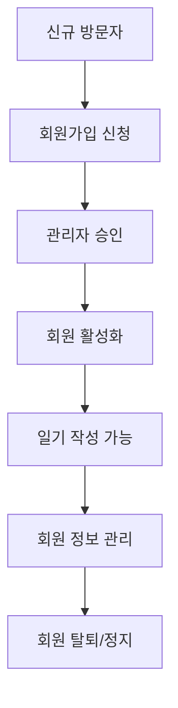
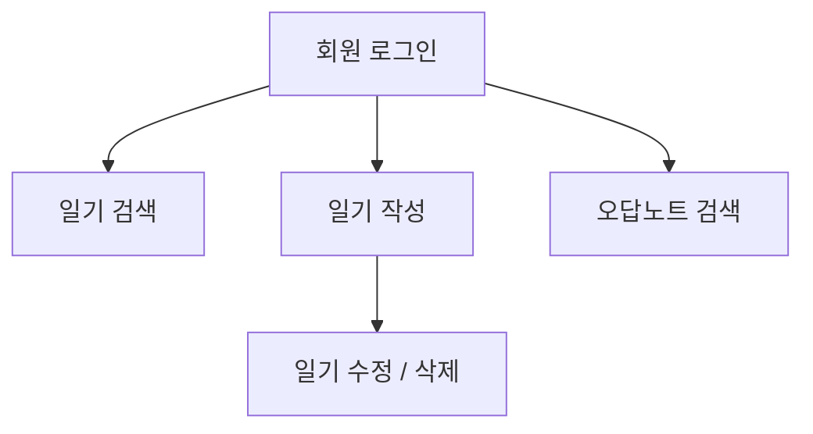
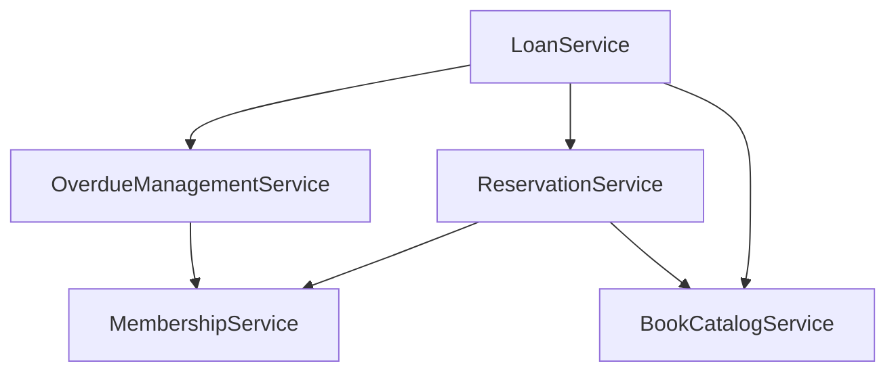

# 도메인 설계서

## 문서 정보
- **프로젝트명**: 개발 일기 프로젝트 
- **작성자**: [3조/김인태]
- **작성일**: [2025-06-25]
- **버전**: [v1.0]
---

## 1. 프로젝트 개요

### 1.1 프로젝트 목적
> 개발자의 학습과 성장을 지원하는 개발 일기 작성 시스템으로, 일일 개발 활동을 체계적으로 기록하고 축적된 경험을 효과적으로 활용할 수 있도록 돕는 서비스를 제공한다.

### 1.2 프로젝트 범위
**포함 범위:**
- [ ] 회원 관리 (등록, 정보 수정, 탈퇴)
- [ ] 일기 관리 (등록, 수정, 삭제, 검색)
- [ ] 에러 관리 (등록, 수정, 삭제, 검색)
- [ ] 태그 시스템 (태그를 활용한 접근성 높은 검색)

**제외 범위:**
- [ ] 깃 허브 연동 (코드 저장은 간단하게만)
- [ ] 모바일 앱 (웹 기반만)

### 1.3 주요 이해관계자 (Stakeholders)
| 구분 | 역할 | 주요 관심사 |
|-----|------|------------|
| **개발자** | 시스템 사용자 | 편리한 일일 개발 활동 기록, 직관적인 인터페이스 |
| **IT 관리자** | 시스템 관리자 | 시스템 안정성, 보안, 유지보수성 |

---

## 2. 비즈니스 도메인 분석

### 2.1 핵심 비즈니스 프로세스

#### 2.1.1 회원 관리 프로세스


**상세 플로우:**
1. **회원가입 단계**
   - 개인정보 입력 (이름, 연락처, 주소 등)
   - 이메일 인증
   - 관리자 승인 대기
   - 회원번호(ID) 자동 발급

2. **회원 활동 단계**
   - 일기 작성 및 일기 검색
   - 개인정보 수정
   - 오답노트 조회

#### 2.1.2 일기 관리 프로세스


**비즈니스 규칙:**
- 작성일자와 프로젝트명은 반드시 입력해야 함
- 회원당 일기 작성 제한 없음
- 일반 태그와 에러 태그는 별도로 관리

### 2.2 비즈니스 이벤트
| 이벤트 | 트리거 | 결과 |
|--------|--------|------|
| **회원가입 완료** | 관리자 승인 | 회원번호 발급, 환영 이메일 발송 |
| **일기 작성 완료** | 회원 작성 | 일기 수 증가, 작성일 설정, 태그 설정 |
| **일기 수정 완료** | 회원 수정 | 기존 일기 내용 업데이트 |
| **일기 삭제 완료** | 회원 삭제 | 일기 수 감소 |
| **일기 검색** | 회원 검색 | 필터에 맞는 일기 제공 |
| **오답노트 검색** | 회원 검색 | 필터에 맞는 에러 기록 제공 |

---

## 3. 핵심 도메인 객체 (Domain Objects)

### 3.1 도메인 객체 식별 매트릭스
| 도메인 객체 | 유형 | 중요도 | 복잡도 | 비고 |
|------------|------|--------|--------|------|
| **Member (회원)** | Entity | 높음 | 중간 | 핵심 사용자 |
| **Diary (일기)** | Entity | 높음 | 중간 | 핵심 자원 |
| **Tag (태그)** | Entity | 중간 | 낮음 | 일기 분류 |
| **Admin (관리자)** | Entity | 중간 | 낮음 | 시스템 운영자 |

### 3.2 상세 도메인 객체 정의

#### 3.2.1 Member (회원)
**역할**: 도서관 서비스를 이용하는 회원을 나타냄

**주요 속성:**


**주요 행동 (메서드):**


**비즈니스 규칙:**


#### 3.2.2 Diary (일기)
**역할**: 회원이 작성하는 일일 개발 일기 

**주요 속성:**
- `did`: 고유 식별자 
- `date`: 일기 작성 일자
- `project`: 프로젝트명
- `devfeel`: 느낀점
- `diff`: 어려웠던점 
- `error`: 발생 에러
- `explaination`: 에러에 대한 설명
- `diaryTags`: 일기 태그


**주요 행동 (메서드):**
- `getTags()`: 태그 리스트 추출 메서드

**비즈니스 규칙:**
- 작성 일자와 프로젝트 명은 반드시 입력해야함
- 하루에 여러 개의 일기를 작성할 수 있음

#### 3.2.3 Tags (태그)
**역할**: 회원과 도서 간의 대출 관계를 나타냄

**주요 속성:**
- `id`: 고유 식별자 
- `name`: 태그 이름

**비즈니스 규칙:**
- 일반 태그와 에러 태그는 따로 관리
---

## 4. 도메인 관계도

### 4.1 개념적 관계도
```mermaid
erDiagram
    MEMBER ||--o{ DIARY : "조회, 작성"
    DIARY ||--o{ DIARYTAG : "태그"
    PROJECT ||--o{ DIARY : "포함"
    TAG ||--o{ DIARYTAG : "분류"
    
    MEMBER {
        Long id PK
        string memberNumber UK
        string name
        string email UK
        string status
    }
    
    DIARY {
        Long did PK
        LocalDate date
        Project project
        string devfeel
        string diff
        string error
        string explaination
        List<DiaryTag> diaryTags
    }
    
    PROJECT {
        Long pid PK
        string name UK
    }
    
    DIARYTAG {
        Long dtid PK
        Long did FK
        Long tid FK
    }
    
    TAG {
        Long tid PK
        string name UK
        List<DiaryTag> diaryTags
    }
    
```

### 4.2 관계 상세 설명
| 관계 | 카디널리티 | 설명 |
|------|------------|------|
| **Member ↔ Diary** | 1:N | 한 회원은 여러 일기를 작성할 수 있음   |
| **Tag ↔ DiaryTag** | 1:N | 한 태그가 여러 일기와 연결됨 |
| **Project ↔ Diary** | 1:N | 한 프로젝트가 여러 일기와 연결됨 |
| **DiaryTag ↔ Diary** | N:1 | 다이어리에 여러개의 태그 가능   |
| **DiaryTag ↔ Tag** | N:1 | 태그 중간 연결 | 

---

## 5. 비즈니스 규칙 (Business Rules)

### 5.1 회원 관련 규칙
| 규칙 ID | 규칙 내용 | 우선순위 | 검증 방법 |
|---------|-----------|----------|-----------|
| **BR-M001** | 회원은 최대 5권까지 동시 대출 가능 | 높음 | 대출 신청 시 현재 대출 수 확인 |
| **BR-M002** | 연체 중인 회원은 추가 대출 불가 | 높음 | 대출 신청 시 연체 상태 확인 |
| **BR-M003** | 이메일은 회원별로 유일해야 함 | 높음 | 회원가입/수정 시 중복 검사 |
| **BR-M004** | 정지된 회원은 모든 서비스 이용 불가 | 높음 | 로그인 시 상태 확인 |
| **BR-M005** | 회원번호는 M으로 시작하는 10자리 | 중간 | 자동 생성 시 형식 검증 |

### 5.2 도서 관련 규칙
| 규칙 ID | 규칙 내용 | 우선순위 | 검증 방법 |
|---------|-----------|----------|-----------|
| **BR-B001** | ISBN은 13자리 숫자이며 유일해야 함 | 높음 | 도서 등록 시 형식 및 중복 검사 |
| **BR-B002** | 대출 가능 권수는 총 권수를 초과할 수 없음 | 높음 | 재고 수정 시 논리적 검증 |
| **BR-B003** | 대출 중인 도서가 있으면 삭제 불가 | 높음 | 삭제 전 대출 상태 확인 |
| **BR-B004** | 재고가 0인 도서는 예약만 가능 | 중간 | 대출 신청 시 재고 확인 |

### 5.3 대출 관련 규칙
| 규칙 ID | 규칙 내용 | 우선순위 | 검증 방법 |
|---------|-----------|----------|-----------|
| **BR-L001** | 기본 대출 기간은 14일 | 높음 | 대출 승인 시 자동 계산 |
| **BR-L002** | 연체료는 1일당 100원 | 높음 | 반납 시 자동 계산 |
| **BR-L003** | 대출 연장은 1회만 가능하며 7일 연장 | 중간 | 연장 신청 시 이력 확인 |
| **BR-L004** | 대출번호는 L+년월일+순번 형식 | 낮음 | 자동 생성 시 형식 적용 |

### 5.4 예약 관련 규칙
| 규칙 ID | 규칙 내용 | 우선순위 | 검증 방법 |
|---------|-----------|----------|-----------|
| **BR-R001** | 같은 도서에 대해 중복 예약 불가 | 높음 | 예약 신청 시 중복 검사 |
| **BR-R002** | 예약 우선순위는 신청 순서대로 | 높음 | 예약 생성 시 순서 부여 |
| **BR-R003** | 예약 알림 후 3일 내 미응답 시 다음 순서로 | 중간 | 배치 작업으로 처리 |

---

## 6. 도메인 서비스 (Domain Services)

### 6.1 식별된 도메인 서비스
| 서비스명 | 책임 | 사용 시나리오 |
|----------|------|---------------|
| **LoanService** | 대출 비즈니스 로직 관리 | 대출 신청, 승인, 반납, 연장 |
| **ReservationService** | 예약 및 대기열 관리 | 예약 신청, 알림 발송, 순서 관리 |
| **OverdueManagementService** | 연체 관리 | 연체 확인, 연체료 계산, 알림 |
| **MembershipService** | 회원 자격 관리 | 회원 등급, 대출 한도 관리 |
| **BookCatalogService** | 도서 카탈로그 관리 | 도서 검색, 분류, 인기도 계산 |

### 6.2 서비스 상호작용


---

## 7. 용어 정의 (Glossary)

### 7.1 비즈니스 용어
| 용어 | 정의 | 영문 | 비고 |
|------|------|------|------|
| **대출가능도서** | 현재 재고가 1권 이상인 도서 | Available Book | 즉시 대출 신청 가능 |
| **연체** | 반납예정일을 초과한 미반납 상태 | Overdue | 연체료 발생 |
| **활성회원** | 가입 후 승인이 완료된 정상 상태 회원 | Active Member | 모든 서비스 이용 가능 |
| **대출이력** | 과거 대출했던 모든 기록 | Loan History | 반납 완료된 기록 포함 |
| **예약** | 현재 대출 불가능한 도서에 대한 우선 신청 | Reservation | 대기열 관리 |
| **회원등급** | 대출 실적에 따른 회원 분류 | Member Grade | 향후 확장 예정 |

### 7.2 기술 용어
| 용어 | 정의 | 비고 |
|------|------|------|
| **자연키** | 비즈니스적 의미를 가진 식별키 | ISBN, 회원번호 등 |
| **대리키** | 시스템에서 생성하는 인위적 식별키 | Auto Increment ID |
| **소프트 삭제** | 실제 삭제 대신 삭제 플래그 설정 | 데이터 복구 가능 |
| **낙관적 락** | 충돌이 드물다고 가정하는 동시성 제어 | 버전 기반 제어 |

---

## 8. 가정사항 및 제약조건

### 8.1 가정사항 (Assumptions)
- [ ] 모든 회원은 이메일 주소를 보유하고 있음
- [ ] 도서 ISBN은 항상 13자리 형식으로 제공됨
- [ ] 관리자는 업무 시간 내에만 대출 승인 처리
- [ ] 회원들은 기본적인 웹 사용 능력을 보유
- [ ] 시스템은 한국어로만 서비스 제공

### 8.2 제약조건 (Constraints)
- [ ] **기술적 제약**: Java 11, Spring Boot 2.7, MySQL 8.0 사용
- [ ] **성능 제약**: 응답 시간 3초 이내, 동시 사용자 100명
- [ ] **보안 제약**: 개인정보보호법 준수, HTTPS 필수
- [ ] **운영 제약**: 주 7일 24시간 서비스, 월 1회 정기 점검
- [ ] **예산 제약**: 클라우드 서비스 월 100만원 이내

### 8.3 위험요소 (Risks)
| 위험 | 영향도 | 발생확률 | 대응방안 |
|------|--------|----------|----------|
| **ISBN 중복 등록** | 높음 | 낮음 | 등록 시 중복 검사 강화 |
| **동시 대출 신청** | 중간 | 중간 | 낙관적 락으로 동시성 제어 |
| **대량 연체 발생** | 높음 | 낮음 | 자동 알림 시스템 구축 |
| **시스템 과부하** | 높음 | 낮음 | 로드 밸런싱 및 캐시 적용 |

---

## 9. 향후 확장 계획

### 9.1 단기 확장 (3개월 내)
- [ ] 모바일 반응형 UI 개선
- [ ] 이메일/SMS 자동 알림 기능
- [ ] 도서 추천 시스템 기초 구현
- [ ] 통계 대시보드 고도화

### 9.2 중기 확장 (6개월 내)
- [ ] 모바일 앱 개발
- [ ] 외부 도서 API 연동 (국립중앙도서관 등)
- [ ] 전자책 대출 서비스
- [ ] 회원 등급 시스템 도입

### 9.3 장기 확장 (1년 내)
- [ ] 다국어 지원 (영어, 중국어)
- [ ] AI 기반 도서 추천
- [ ] 타 도서관과의 상호 대차 서비스
- [ ] 블록체인 기반 디지털 증명서

---

## 10. 검토 및 승인

### 10.1 검토 이력
| 버전 | 검토자 | 검토일 | 주요 변경사항 |
|------|--------|--------|---------------|
| v0.1 | [팀 리더] | 2025-05-20 | 초안 작성 |
| v0.2 | [백엔드 개발자] | 2025-05-21 | 도메인 객체 상세화 |
| v0.3 | [프론트엔드 개발자] | 2025-05-22 | 사용자 시나리오 보완 |
| v1.0 | [프로젝트 매니저] | 2025-05-23 | 최종 승인 |

---

**문서 끝**
